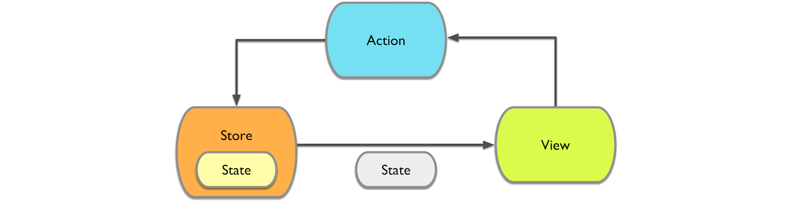

[](https://github.com/Carthage/Carthage) 
[](https://github.com/Swift-Flow/Swift-Flow/blob/master/LICENSE.md)

#Table of Contents

- [About Swift Flow](#about-swift-flow)
- [Why Swift Flow?](#why-swift-flow)
- [Getting Started Guide](#getting-started-guide)
- [Installation](#installation)
- [Demo](#demo)
- [Extensions](#extensions)
- [Example Projects](#example-projects)
- [Credits](#credits)
- [Get in touch](#get-in-touch)


#About Swift Flow

**This library is a pre-release. Expect missing docs and breaking API changes.**

Swift Flow is a [Redux](https://github.com/rackt/redux)-like implementation of the unidirectional data flow architecture in Swift. It embraces a unidirectional data flow that only allows state mutations through declarative actions.

It relies on a few principles:
- **The Store** stores your entire app state in the form of a single data structure. This state can only be modified by dispatching Actions to the store. Whenever the state in the store changes, the store will notify all observers.
- **Actions** are a declarative way of describing a state change. Actions don't contain any code, they are consumed by the store and forwarded to reducers. Reducers will handle the actions by implementing a different state change for each action.
- **Reducers** provide pure functions, that based on the current action and the current app state, create a new app state



For a very simple app, that maintains a counter that can be increased and decreased, you can define the app state as following:

```swift
struct AppState: StateType, HasNavigationState {
    var counter: Int = 0
}
```

You would also define two actions, one for increasing and one for decreasing the counter. In the [Getting Started Guide](Readme/GettingStarted.md) you can find out how to construct complex actions. For the simple actions in this example we can define string constants:

```swift
let CounterActionIncrease = "COUNTER_ACTION_INCREASE"
let CounterActionDecrease = "COUNTER_ACTION_DECREASE"
```

Your reducer needs to respond to these different action types, that can be done by switching over the type of action:

```swift
struct CounterReducer: Reducer {

    func handleAction(var state: AppState, action: Action) -> AppState {
        switch action.type {
        case CounterActionIncrease:
            state.counter += 1
        case CounterActionDecrease:
            state.counter -= 1
        default:
            break
        }

        return state
    }

}
```
In order to have a predictable app state, it is important that the reducer is always free of side effects, it receives the current app state and an action and returns the new app state.

Lastly, your view layer, in this case a view controller, needs to tie into this system by subscribing to store updates and emitting actions whenever the app state needs to be changed:

```swift
class CounterViewController: UIViewController, StoreSubscriber {

    @IBOutlet var counterLabel: UILabel!

    override func viewWillAppear(animated: Bool) {
        mainStore.subscribe(self)
    }

    override func viewWillDisappear(animated: Bool) {
        mainStore.unsubscribe(self)
    }

    func newState(state: AppState) {
        counterLabel.text = "\(state.counter)"
    }

    @IBAction func increaseButtonTapped(sender: UIButton) {
        mainStore.dispatch(
            Action(CounterActionIncrease)
        )
    }

    @IBAction func decreaseButtonTapped(sender: UIButton) {
        mainStore.dispatch(
            Action(CounterActionDecrease)
        )
    }
    
}
```

The `newState` method will be called by the `Store` whenever a new app state is available, this is where we need to adjust our view to reflect the latest app state.

Button taps result in dispatched actions that will be handled by the store and its reducers, resulting in a new app state.

This is a very basic example that only shows a subset of Swift Flow's features, read the Getting Started Guide to see how you can build entire apps with this architecture.

#Why Swift Flow?

Model-View-Controller (MVC) is not a holistic application architecture. Typical Cocoa apps defer a lot of complexity to controllers since MVC doesn't offer other solutions for state management, one of the most complex issues in app development. 

Apps built upon MVC often end up with a lot of complexity around state management and propagation. We need to use callbacks, delegations, Key-Value-Observation and notifications to pass information around in our apps and to ensure that all the relevant views have the latest state.

This approach involves a lot of manual steps and is thus error prone and doesn't scale well in complex code bases.

It also leads to code that is difficult to understand at a glance, since dependencies can be hidden deep inside of view controllers. Lastly, you mostly end up with inconsistent code, where each developer uses the state propagation procedure they personally prefer. You can circumvent this issue by style guides and code reviews but you cannot automatically verify the adherence to these guidelines.

Swift Flow attempts to solve these problem by placing strong constraints on the way applications can be written. This reduces the room for programmer error and leads to applications that can be easily understood - by inspecting the application state data structure, the actions and the reducers.

#Getting Started Guide

[A Getting Started Guide that describes the core components of apps built with Swift Flow lives here](Readme/GettingStarted.md). It will be expanded in the next few weeks. To get an understanding of the core principles I recommend reading the brilliant [redux documentation](http://rackt.org/redux/).

#Installation

You can install SwiftFlow via [Carthage]() by adding the following line to your Cartfile:

	github "Swift-Flow/Swift-Flow"
	
#Demo

Using this library you can implement apps that have an explicit, reproducible state, allowing you, among many other things, to replay and rewind the app state, as shown below:


	
#Extensions

This repository contains the core component for Swift Flow, the following extensions are available:

- [Swift-Flow-Router](https://github.com/Swift-Flow/Swift-Flow-Router): Provides a SwiftFlow compatible Router that allows declarative routing in iOS applications
- [Swift-Flow-Recorder](https://github.com/Swift-Flow/Swift-Flow-Recorder): Provides a `Store` implementation that records all `Action`s and allows for hot-reloading and time travel

#Example Projects

- [CounterExample](https://github.com/Swift-Flow/CounterExample): A very simple counter app implemented with Swift Flow. This app also demonstrates the basics of routing with SwiftFlowRouter.
- [Meet](https://github.com/Ben-G/Meet): A real world application being built with Swift Flow - currently still very early on.

#Credits

- Thanks a lot to [Dan Abramov](https://github.com/gaearon) for building [Redux](https://github.com/rackt/redux) - all ideas in here and many implementation details were provided by his library.

#Get in touch

If you have any questions, you can find me on twitter [@benjaminencz](https://twitter.com/benjaminencz).